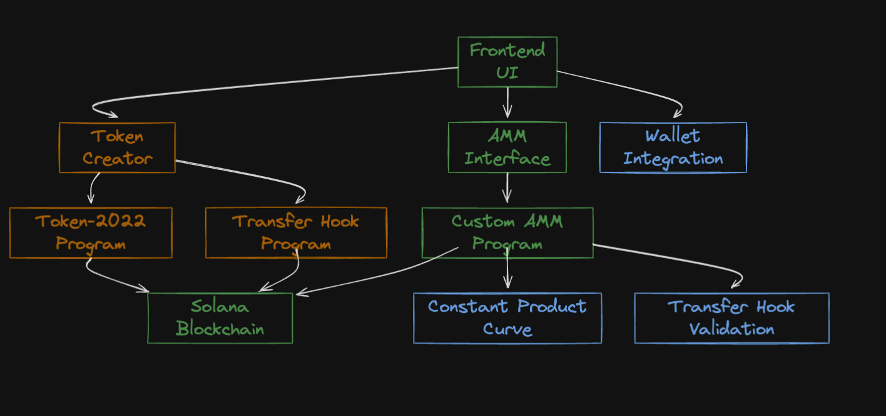
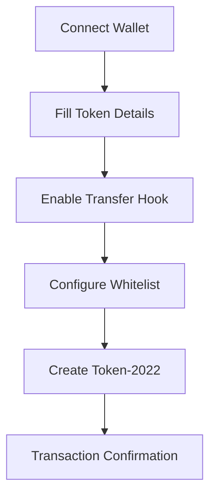
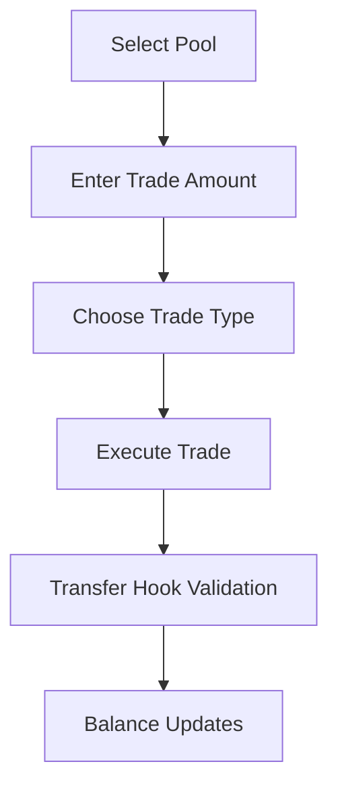

# 🚀 Token-2022 with Transfer Hooks AMM

<div align="center">


**🎯 The First AMM Supporting Token-2022 with Active Transfer Hooks on Solana**

[](https://github.com/rishavmehra/amm-token2022)
[](https://github.com/rishavmehra/amm-token2022)

</div>

---

## ✨ **Project Overview**

| **Project** | **Token-2022 with Transfer Hooks AMM** |
|-------------|----------------------------------------|
| **Status**  | 🟢 **COMPLETED** - Full implementation with UI and smart contracts |
| **Goal**    | Enable trading of Token-2022 tokens with active transfer hooks on Solana AMMs |
| **Network** | Solana Devnet/Testnet/Mainnet |

---

## 🎯 **The Problem We Solve**

Token-2022 represents a **revolutionary upgrade** for the Solana ecosystem, enabling:

<div align="center">

| 🔐 **Whitelisting & KYC** | 🎭 **Conditional Transfers** | ⚡ **Programmable Behaviors** | 🌍 **RWA Tokenization** |
|---------------------------|------------------------------|------------------------------|-------------------------|
| Secure access control     | Smart transfer rules         | Via Transfer Hooks          | Real-world assets       |

</div>

**However, there's a critical gap:** 🚫 **No major AMMs** (Raydium, Orca, Meteora) currently support trading Token-2022 with active transfer hooks, severely limiting its adoption as a DeFi primitive.

---

## 🏗️ **Our Solution Architecture**

### **Approach: Build a New AMM Supporting Token-2022 + Transfer Hooks**

We've implemented a **custom AMM** specifically designed to handle Token-2022 tokens with transfer hooks, ensuring:

<div align="center">

| ✅ **Security** | ✅ **Compatibility** | ✅ **Scalability** | ✅ **User Experience** |
|-----------------|---------------------|-------------------|----------------------|
| Transfer hook logic never bypassed | Full Token-2022 program integration | Extensible for other hook programs | Intuitive UI for token creation and trading |

</div>



---

## 🔧 **Technical Implementation**

### **1. Smart Contract Layer (Anchor Programs)**

#### **🔄 Custom AMM Program (`anchor-amm-2025`)**

**📍 Location:** [`programs/anchor-amm-2025/src/`](https://github.com/rishavmehra/amm-token2022/tree/main/programs/anchor-amm-2025/src)

**🔑 Program ID:** `DXroBepak55dVb4NzAKVGvvmrF5a63j6sEfgjzLTytFB`

**🌟 Key Features:**
- **Constant Product AMM** with liquidity pools
- **Token-2022 native support** via `anchor_spl::token_interface`
- **Transfer fee handling** for Token-2022 extensions
- **Advanced pool management** with configurable parameters

**📝 Core Functions:**

```rust
// 🚀 Initialize AMM with configurable fees
pub fn initialize(ctx: Context<Initialize>, seed: u64, fee: u16, authority: Option<Pubkey>)

// 💧 Deposit liquidity to create LP tokens
pub fn deposit(ctx: Context<Deposit>, amount: u64, max_x: u64, max_y: u64, expiration: i64)

// 🔄 Execute swaps between token pairs
pub fn swap(ctx: Context<Swap>, is_x: bool, amount: u64, min: u64, expiration: i64)

// 💸 Withdraw liquidity and burn LP tokens
pub fn withdraw(ctx: Context<Withdraw>, amount: u64, min_x: u64, min_y: u64, expiration: i64)
```

**🔗 Transfer Hook Integration:**

```rust
// Swap context handles Token-2022 transfer fees
pub struct Swap<'info> {
    pub token_program: Program<'info, Token2022>,
    // ... other fields
}

// Transfer fee calculation during swaps
let extension_data = mint_with_extension.get_extension::<TransferFeeConfig>()?;
let fee = extension_data.calculate_epoch_fee(epoch, amount).unwrap();
```

#### **🎣 Transfer Hook Program (`transfer-hook`)**

**📍 Location:** [`programs/transfer-hook/src/`](https://github.com/rishavmehra/amm-token2022/tree/main/programs/transfer-hook/src)

**🔑 Program ID:** `CWZUjJvvUqN4xS5wKLJsPgcc3ZmZQqHasqKojtLTuCAA`

**🌟 Key Features:**
- **Whitelist-based transfer control**
- **Authority management** for whitelist updates
- **Transfer state validation** during token movements

**📝 Core Functions:**

```rust
// 🚀 Initialize transfer hook metadata
pub fn initialize_extra_account_meta_list(ctx: Context<InitializeExtraAccountMetaList>)

// 🎯 Execute transfer hook logic
pub fn transfer_hook(ctx: Context<TransferHook>, _amount: u64)

// ➕ Add addresses to whitelist
pub fn add_to_whitelist(ctx: Context<AddToWhiteList>)
```

**🏗️ Whitelist Structure:**

```rust
#[account]
pub struct WhiteList {
    pub authority: Pubkey,        // Who can modify the whitelist
    pub white_list: Vec<Pubkey>,  // List of allowed addresses
}
```

### **2. Frontend Application (Next.js + TypeScript)**

#### **🎨 Token Creator Component (`TokenCreator.tsx`)**

**📍 Location:** `components/defi/TokenCreator.tsx`

**🌟 Features:**
- **Token-2022 creation** with configurable parameters
- **Transfer hook integration** with program selection
- **Whitelist management** for access control
- **Real-time validation** and error handling

**🔄 Token Creation Flow:**



**📋 Token Form Interface:**

```tsx
interface TokenFormData {
  name: string;                    // Token Name
  symbol: string;                  // Token Symbol
  decimals: number;                // Decimal Places
  totalSupply: number;             // Total Supply
  transferHook: boolean;           // Enable Transfer Hook
  hookProgramId: string;           // Hook Program ID
  whitelistAddresses: string[];    // Whitelist Addresses
}
```

#### **💱 AMM Interface Component (`AMMInterface.tsx`)**

**📍 Location:** `components/defi/AMMInterface.tsx`

**🌟 Features:**
- **Liquidity Pool Creation** for SOL-token pairs
- **Real-time Trading** with price calculations
- **Pool Analytics** and trade history
- **Wallet Integration** for transaction signing

**🔄 Trading Flow:**



---

## 🚀 **User Guide**

### **Step 1: Create Token-2022 with Transfer Hook** 🎯

1. **🔗 Connect Wallet** using the wallet adapter
2. **📝 Fill Token Details:**
   - **Token Name** (e.g., "My Transfer Hook Token")
   - **Token Symbol** (e.g., "MTHT")
   - **Decimals** (recommended: 9)
   - **Total Supply** (e.g., 1,000,000)
3. **✅ Enable Transfer Hook** (recommended)
4. **👥 Configure Whitelist** addresses (optional)
5. **🚀 Click "Create Token-2022 with Transfer Hook"**

**🎉 Expected Output:**
- ✅ Token mint address
- ✅ Associated token account
- ✅ Transfer hook program integration
- ✅ Transaction confirmation

### **Step 2: Create Liquidity Pool** 💧

1. **🧭 Navigate to AMM Interface**
2. **📊 Enter Pool Details:**
   - **Token Mint Address** (from Step 1)
   - **Initial Token Amount**
   - **Initial SOL Amount**
3. **🚀 Click "Create Pool"**

**🏊 Pool Features:**
- **Real-time Price Calculation** based on constant product curve
- **Liquidity Provision** with LP token rewards
- **Trade Analytics** and volume tracking

### **Step 3: Execute Trades** 🔄

1. **🎯 Select Pool** from available liquidity pools
2. **💰 Enter Trade Amount** in SOL
3. **🔄 Choose Trade Type:**
   - **🟢 Buy:** SOL → Token
   - **🔴 Sell:** Token → SOL
4. **⚡ Click "Trade"**

**⚙️ Trade Execution:**
- **🎣 Transfer Hook Validation** ensures compliance
- **💸 Automatic Fee Calculation** for Token-2022 extensions
- **📱 Real-time Balance Updates** in all interfaces

---

## 🔒 **Security Features**

### **🛡️ Transfer Hook Protection**

| **Feature** | **Description** |
|-------------|-----------------|
| **🚫 No Bypass Possible** | All transfers go through hook validation |
| **👥 Whitelist Enforcement** | Only authorized addresses can receive tokens |
| **🔑 Authority Control** | Whitelist updates require proper authorization |

### **🛡️ AMM Security**

| **Feature** | **Description** |
|-------------|-----------------|
| **📈 Constant Product Curve** | Prevents price manipulation |
| **⏰ Expiration Timestamps** | Protects against MEV attacks |
| **✅ Input Validation** | Comprehensive parameter checking |

### **🛡️ Smart Contract Safety**

| **Feature** | **Description** |
|-------------|-----------------|
| **⚓ Anchor Framework** | Built-in security features |
| **🔐 Account Validation** | Proper account ownership checks |
| **⚠️ Error Handling** | Graceful failure modes |

---

## 📊 **Technical Specifications**

### **📈 Performance Metrics**

<div align="center">

| **Metric** | **Value** |
|------------|-----------|
| **⚡ Transaction Speed** | ~400ms average confirmation |
| **⛽ Gas Efficiency** | Optimized for Solana's low-fee environment |
| **📈 Scalability** | Supports unlimited token pairs |

</div>

### **🌐 Supported Networks**

| **Network** | **Status** | **Use Case** |
|-------------|------------|--------------|
| **🟢 Devnet** | ✅ Available | Testing & Development |
| **🟡 Testnet** | ✅ Available | Staging & QA |
| **🔴 Mainnet** | 🔄 Planned | Production Deployment |

### **🎯 Token Standards**

| **Standard** | **Support Level** | **Description** |
|--------------|-------------------|-----------------|
| **🟢 Token-2022** | ✅ Primary | Main focus with full features |
| **🟡 SPL Token** | ✅ Fallback | Basic compatibility |
| **🔵 Custom Extensions** | ✅ Supported | Transfer fees, hooks |

---

## 🚀 **Quick Start Guide**

### **📋 Prerequisites**

- **Node.js** 22+
- **Solana wallet** on devnet (e.g., Backpack, Phantom)
- **Devnet SOL** for fees (airdrop if needed)

### **⚙️ Installation**

```bash
# Clone the repository
git clone https://github.com/rishavmehra/amm-token2022.git
cd amm-token2022/token-dex

# Install dependencies
npm install
```

### **⚙️ Configuration**

Create `.env.local` in the project root:

```env
NEXT_PUBLIC_TRANSFER_HOOK_PROGRAM_ID=DXroBepak55dVb4NzAKVGvvmrF5a63j6sEfgjzLTytFB
```

> **⚠️ Note:** Replace with your deployed transfer-hook program ID.

### **🚀 Running the Application**

```bash
# Development mode
npm run dev

# Production build
npm run build

# Serve production build
npm start
```

**🌐 Open:** `http://localhost:3000`

### **⚡ Quick Start Workflow**

1. **🔗 Connect your wallet** (devnet)
2. **🎯 Create a Token-2022 mint** (Transfer Hook enabled)
3. **💧 Create a SOL/token pool** (paste mint, set amounts)
4. **🔄 Trade using the pool card** (buy/sell)
5. **🌐 Optional:** Use the Jupiter tab to preview routes on devnet

---

## 📝 **Important Notes**

- **🟡 Devnet Only:** This is a UI demonstration, not production-ready
- **🔒 Hook Enforcement:** Transfer hook logic resides in your on-chain program
- **🧪 Testing:** Use devnet SOL for all transactions and testing

---

## 🤝 **Contributing**

We welcome contributions! Please feel free to submit issues, feature requests, or pull requests.

---

## 📄 **License**

This project is licensed under the MIT License.

---

<div align="center">

## **Made with ❤️ by Rishav Mehra**

[](https://github.com/rishavmehra)
[](https://linkedin.com/in/rishavmehra)
[](https://twitter.com/rishavmehraa)

**⭐ Star this repository if you found it helpful!**

</div>
